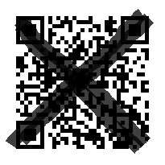

# QR:Misc  
My QR code got dirty!  
I can't read it anymore...  
[./qr.png](https://github.com/tanplustan/i3CTF_2024/blob/main/QR/qr.png)

# Solution
](https://github.com/tanplustan/i3CTF_2024/blob/main/QR/qr.png)  
QRコードを読み取ろうとしても反応しない。試しに角の四角を上から貼り付けてみると読み取りに成功し、FLAGが埋め込まれていた。  

## FLAG{Error_correction_30_percent}
