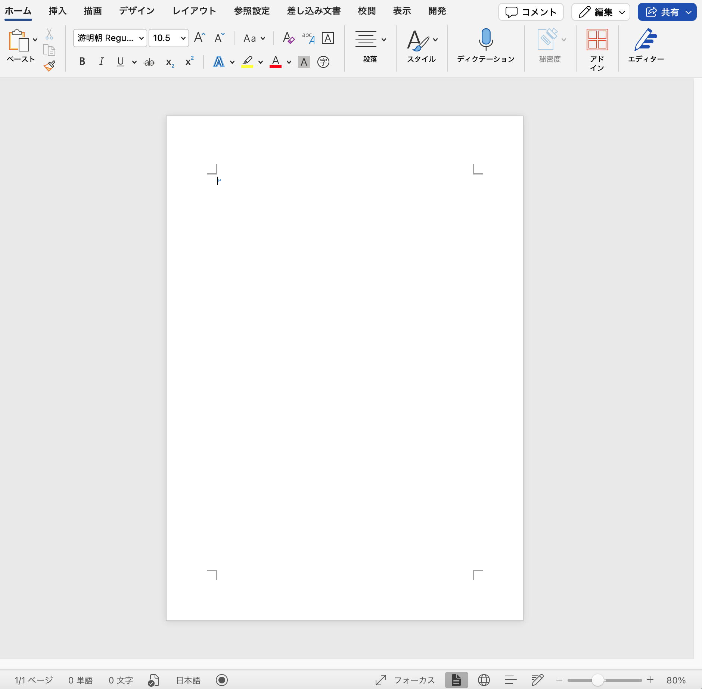

# Word?:Misc
Flag is hidden in this file.  
Please look for Flag.  
[word.docx](./word.docx)

# Solution

ファイルを開いても何も表示されていない。白文字で見えていないだけでもなかったのでwordがXMLで構成されていること知っているかの確認問題と予想。  
zipと同じように展開すると[Content_Types].xmlに
```
<?xml version="1.0" encoding="UTF-8" standalone="yes"?>
<Types xmlns="http://schemas.openxmlformats.org/package/2006/content-types"><Default Extension="rels" ContentType="application/vnd.openxmlformats-package.relationships+xml"/><Default Extension="xml" ContentType="application/xml"/><Override PartName="/word/document.xml" ContentType="application/vnd.openxmlformats-officedocument.wordprocessingml.document.main+xml"/><Override PartName="/word/styles.xml" ContentType="application/vnd.openxmlformats-officedocument.wordprocessingml.styles+xml"/><Override PartName="/word/settings.xml" ContentType="application/vnd.openxmlformats-officedocument.wordprocessingml.settings+xml"/><Override PartName="/word/webSettings.xml" ContentType="application/vnd.openxmlformats-officedocument.wordprocessingml.webSettings+xml"/><Override PartName="/word/fontTable.xml" ContentType="application/vnd.openxmlformats-officedocument.wordprocessingml.fontTable+xml"/><Override PartName="/word/theme/theme1.xml" ContentType="application/vnd.openxmlformats-officedocument.theme+xml"/><Override PartName="/docProps/core.xml" ContentType="application/vnd.openxmlformats-package.core-properties+xml"/><Override PartName="/docProps/app.xml" ContentType="application/vnd.openxmlformats-officedocument.extended-properties+xml"/></Types>

<!--FLAG{Word_is_zip}-->
```
とあるので
## FLAG{Word_is_zip}
